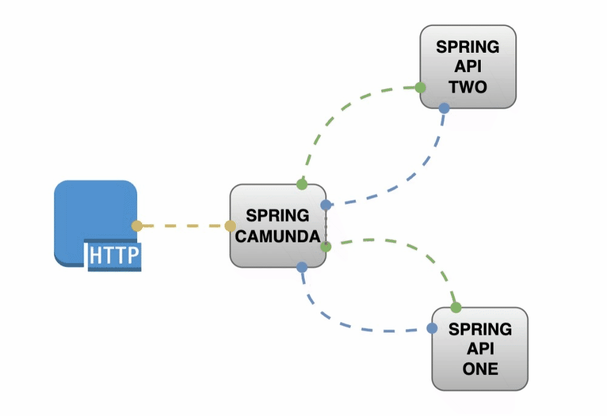
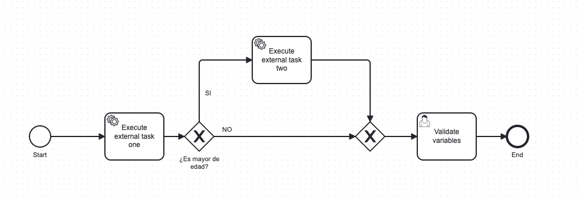

# camunda-external-task

## Stack

- SpringBoot 2.7.9
- JDK17
- Maven
- Postgres | h2
- Camunda 7.19.0
- Docker | Docker Compose


## Build (Opcional)

```shell
mvn clean package
```

## Run

```shell
docker-compose -f docker-compose.yaml -p spring-boot-camunda-external-task up --force-recreate -d
```

## Down

```shell
docker-compose -f docker-compose.yaml -p spring-boot-camunda-external-task down --rmi local --remove-orphans
```

## Arquitectura


## Camunda workflow
